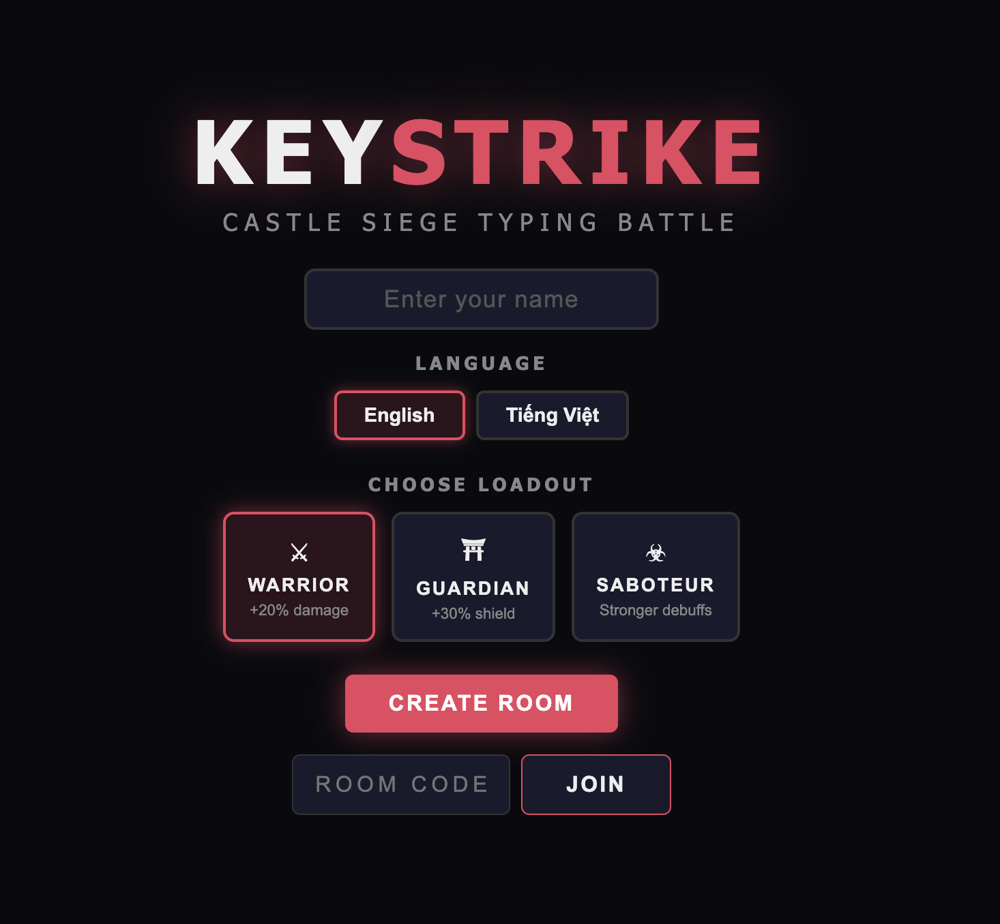
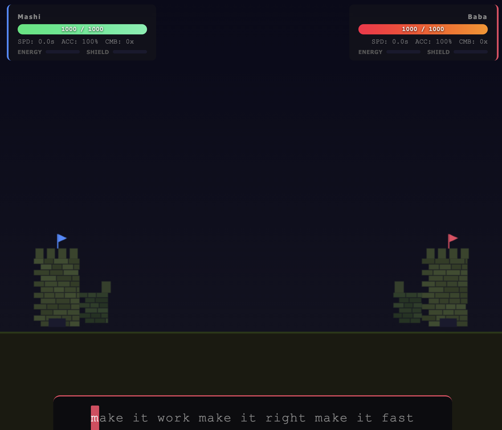

# KeyStrike

1v1 multiplayer typing battle game in the browser. Two players compete by typing sentences as fast and accurately as possible, attacking each other with damage based on speed and accuracy.

<p align="center">
  
  
</p>

## How to Play

- **Host** creates a room and shares the URL + room code with opponent
- **Client** opens the URL, enters the room code, and joins
- Both players click **Ready** to start the 3-2-1 countdown
- Type sentences as fast and accurately as possible to attack your opponent
- Fill your opponent's **chaos meter** to 70% to win
- Watch out for your **corruption meter** — too many mistakes will stun you

## Combat System

Finishing a sentence triggers an attack:

```
damage = baseDamage(10) x speedMultiplier x accuracyMultiplier
```

| Speed     | Multiplier | | Accuracy | Multiplier |
|-----------|------------|-|----------|------------|
| < 2s      | 2.0x       | | 100%     | 1.5x       |
| < 4s      | 1.5x       | | >= 95%   | 1.2x       |
| < 6s      | 1.0x       | | < 90%    | 0.8x       |
| > 6s      | 0.7x       | |          |            |

**Combo bonus**: Fast typing streaks increase damage up to 50%.
**Critical hits**: 30% chance at 5+ combo for 1.5x damage.

## Setup

```bash
npm install
```

Create a `.env` file (optional):

```
PORT=3000
```

## Run

```bash
npm start
```

The server will display local and network URLs:

```
  ⚡ KeyStrike server running!
  Local:   http://localhost:3000
  Network: http://192.168.x.x:3000
```

Open the **Network URL** on two devices/browsers to play.

## Deploy to WAN

The game can be exposed to the public internet. For production deployments:

- Use a **reverse proxy** (nginx, Caddy, Cloudflare Tunnel) to terminate HTTPS/WSS
- Do **not** expose the Node.js server directly without TLS
- The server includes built-in protections:
  - Path traversal prevention on static file serving
  - WebSocket rate limiting (120 msg/s per connection)
  - Message size limit (64KB)
  - Room expiration (30 min) and max room cap (500)
  - Cryptographic room ID generation
  - Input validation and XSS sanitization

Example with nginx:

```nginx
server {
    listen 443 ssl;
    server_name keystrike.example.com;

    ssl_certificate     /path/to/cert.pem;
    ssl_certificate_key /path/to/key.pem;

    location / {
        proxy_pass http://127.0.0.1:3000;
        proxy_http_version 1.1;
        proxy_set_header Upgrade $http_upgrade;
        proxy_set_header Connection "upgrade";
        proxy_set_header Host $host;
    }
}
```

## Tech Stack

- HTML5, CSS3, Vanilla JS (no frameworks)
- Node.js + WebSocket for real-time game data relay
- Canvas rendering for castles and projectile effects

## Project Structure

```
server.js    — Game server + static file server
index.html   — Game UI
style.css    — Styles and animations
network.js   — WebSocket networking layer
game.js      — Game logic, combat, sentences
main.js      — UI controller, input, effects, sound
```
